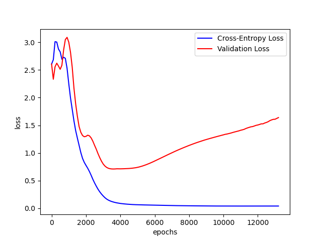

# CTensor

CTensor is a simple and lightweight tensor-like library in pure C. The goal of this project is to provide an easy-to-understand implementation of fundamental tensor operations, and provide a hands-on learning experience for me (and hopefully others :)) into the internal intrisics of neural network frameworks.

CTensor implements a Sequential Model architecture, meaning that each layer will only have exactly one input tensor and one output tensor.

This library is currently a Work-In-Progress (WIP), as such the API/ABI shall be considered highly unstable!

## Getting Started
Clone the repo:
```
git clone https://github.com/diegoroux/ctensor.git
```
Build:
```
mkdir -p build/ && cd build/
cmake ..
```

## Examples
I've been able to successfully overfit a Dense network (784 input nodes, FCL 16 nodes with ReLU, FCL 10 nodes with RELU, Cross-Entropy Loss) on the MNIST Handwritten digit dataset.



## Contributing
Contributions to CTensor are welcome! Whether you find a bug, have a feature request, found a typo or want to contribute code, please feel free to open an issue/submit a pull request.

## License
This project is licensed under the GPLv3 License.
